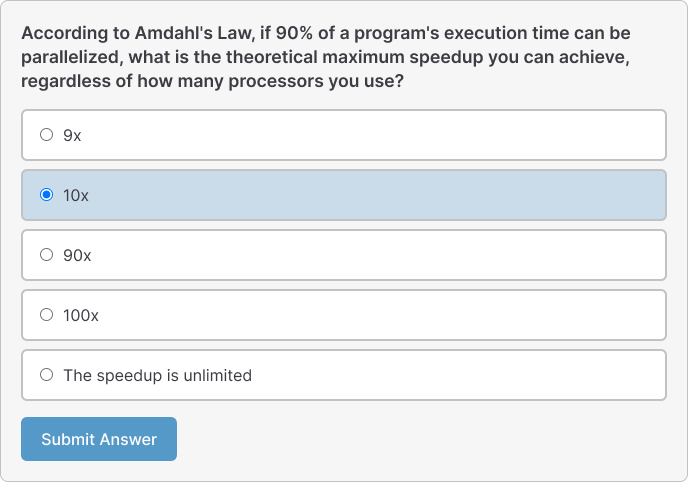
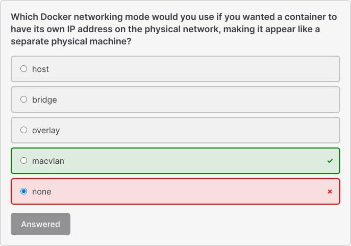

# markdown-it-multiple-choice


<p align="center">
  
  
</p>


A [markdown-it](https://github.com/markdown-it/markdown-it) plugin that converts todo lists into interactive multiple choice questions with Vue.js support.


## How to use

### Installation

You can install markdown-it-multiple-choice as one of your VitePress project dependencies with the following command:

```bash
npm install markdown-it-multiple-choice
```

## Integrate with VitePress

### Configure VitePress config

```js
// .vitepress/config.js
import { defineConfig } from 'vitepress'
import multipleChoicePlugin from 'markdown-it-multiple-choice'

export default defineConfig({
  markdown: {
    config: (md) => {
      md.use(multipleChoicePlugin)
    }
  },
  vite: {
    ssr: {
      noExternal: ['markdown-it-multiple-choice']
    }
  }
})
```

### Step 3: Setup theme

Create `.vitepress/theme/index.js`:

```js
import DefaultTheme from 'vitepress/theme'
import { onMounted } from 'vue'
import { setupMultipleChoice } from 'markdown-it-multiple-choice'
import 'markdown-it-multiple-choice/style.css'

export default {
  extends: DefaultTheme,
  setup() {
    onMounted(() => {
      setupMultipleChoice();
    });
  }
}
```


## Markdown Syntax

The plugin recognizes a special syntax for multiple choice questions:

```markdown
[?] Your question goes here?
[ ] Wrong answer option
[x] Correct answer option (marked with 'x')
[ ] Another wrong answer option
[ ] Yet another wrong answer option
```

### Syntax Rules

- **Question**: Start with `[?]` followed by your question text
- **Correct Answer**: Use `[x]` to mark the correct option
- **Wrong Answers**: Use `[ ]` (empty brackets) for incorrect options
- **Multiple Questions**: Separate questions with blank lines


## API Reference

### Plugin Options

```javascript
const md = new MarkdownIt().use(multipleChoicePlugin, {
  // Plugin options (currently no options available)
});
```

### Vue Component Props

```typescript
interface MultipleChoiceQuestion {
  id: string;
  question: string;
  options: MultipleChoiceOption[];
}

interface MultipleChoiceOption {
  text: string;
  isCorrect: boolean;
  isQuestion?: boolean; // Internal use
}
```

## Styling

### Custom Styling

You can override the default styles by targeting these CSS classes:

```css
.multiple-choice-question {
  /* Question container */
}

.mcq-question {
  /* Question text */
}

.mcq-options {
  /* Options container */
}

.mcq-option {
  /* Individual option */
}

.mcq-option--correct {
  /* Correct option (after submission) */
}

.mcq-option--incorrect {
  /* Incorrect selected option (after submission) */
}

.mcq-submit {
  /* Submit button */
}

.mcq-result {
  /* Result message */
}
```

## Development

```bash
# Install dependencies
npm install

# Build the project
npm run build

# Run tests
npm test

# Development mode (watch for changes)
npm run dev
```

## License

MIT License - see the [LICENSE](LICENSE) file for details.